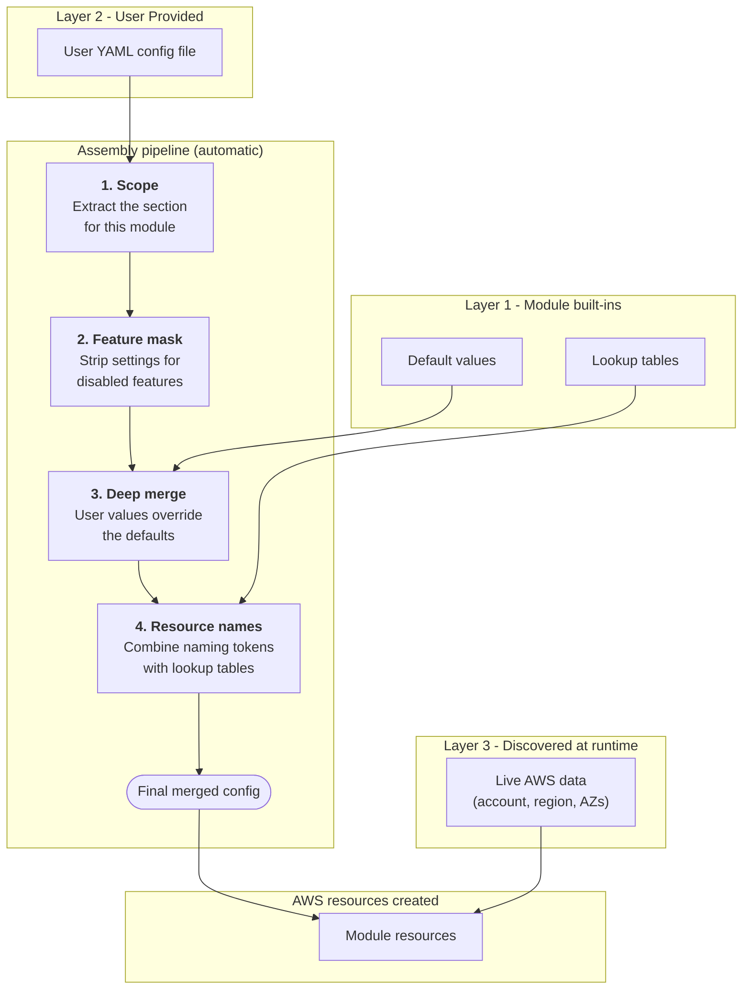

<!-- BEGINNING OF PRE-COMMIT-OPENTOFU DOCS HOOK -->


# Module Summary

| Property       | Detail                                                                |
| -------------- | --------------------------------------------------------------------- |
| Description    | This Terraform pattern represents a security control that can be used to manage access for 3rd parties to AWS accounts |
| Compatible     |   |
| Support        | Professional Support available. Please see [SUPPORT](SUPPORT.md) for more details |

## Reference Example

```hcl

module "fab4c_third_party_access_controller" {

  #checkov:skip=CKV_TF_1:Ignore false positives for URIs that are not Git based.
  # See https://github.com/bridgecrewio/checkov/issues/5366 for more info
  #checkov:skip=CKV_TF_2:Ignore false positive on Terraform Registry modules with pinned version
  # See https://github.com/bridgecrewio/checkov/issues/6335 for more info
  # Normal usage
  source             = "fab4c/fab4c-3rd-party-access-controller/aws"
  version            = "1.5.0"
  configuration_file = "./example.yml"

  # fab4c development usage
  # source             = "../"
  # configuration_file = "./development.yml"

}

# Show important or useful information about the resources managed by this pattern
output "managed_resources" {
  value = module.fab4c_third_party_access_controller.resources
}

```

## Inputs

| Name | Description | Type | Default | Required |
|------|-------------|------|---------|:--------:|
| <a name="input_configuration_file"></a> [configuration\_file](#input\_configuration\_file) | An encoded map payload of configuration attributes in a YAML file | `string` | `"example.yml"` | no |


## Outputs

| Name | Description |
|------|-------------|
| <a name="output_resources"></a> [resources](#output\_resources) | n/a |


## Providers

| Name | Version |
|------|---------|
| <a name="provider_aws"></a> [aws](#provider\_aws) | ~> 6.0 |
| <a name="provider_local"></a> [local](#provider\_local) | 2.4.1 |
| <a name="provider_random"></a> [random](#provider\_random) | ~> 3.6 |
| <a name="provider_template"></a> [template](#provider\_template) | 2.2.0 |


## How Configuration Works

This module uses a **layered configuration** approach. Rather than defining dozens of individual input variables, all configuration is expressed in a single YAML file that you provide. The module then combines that file with its own built-in defaults and live data discovered from AWS to produce a single, authoritative configuration object that drives every resource it creates.

The diagram below walks through that process step by step.



> **Tip — one file, many modules.**  Because the YAML file is keyed by module name at the top level, a single file can hold configuration for several modules side by side. Each module ignores every section that does not belong to it.


<!-- END OF PRE-COMMIT-OPENTOFU DOCS HOOK -->