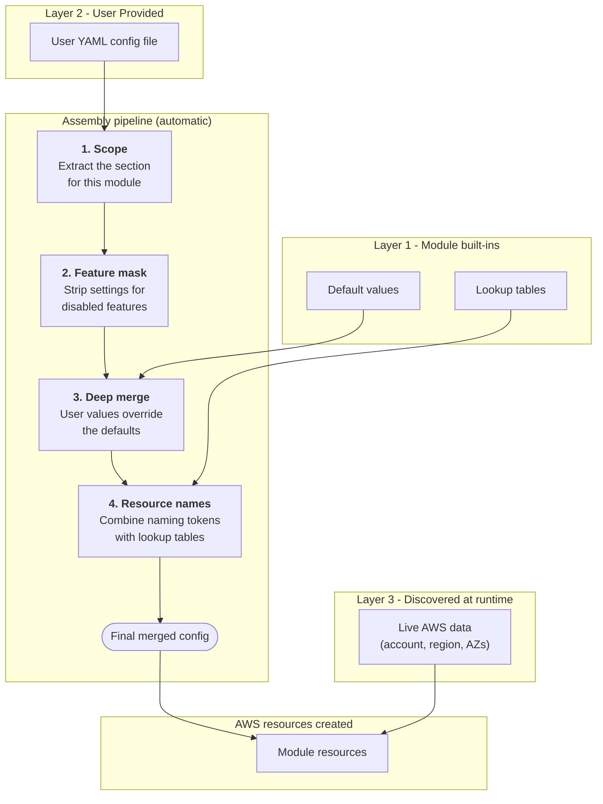

## How Configuration Works

This module uses a **layered configuration** approach. Rather than defining dozens of individual input variables, all configuration is expressed in a single YAML file that you provide. The module then combines that file with its own built-in defaults and live data discovered from AWS to produce a single, authoritative configuration object that drives every resource it creates.

The diagram below walks through that process step by step.

> **Tip — one file, many modules.**  Because the YAML file is keyed by module name at the top level, a single file can hold configuration for several modules side by side. Each module ignores every section that does not belong to it.

